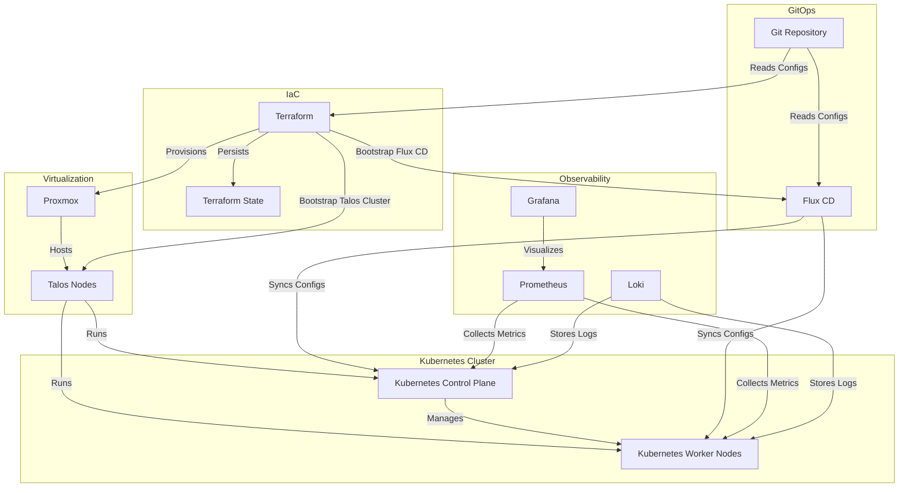

# Platform Engineering Homelab

Exploring declarative infrastructure, automation, Kubernetes, and GitOps for the AI boom era.

## Overview

This project aims to build a **platform service environment** that mimics production-grade practices used by leading technology organizations.

The platform is responsible for:

1. Owning the end-to-end developer experience from code commit to production deployment.
2. Kubernetes cluster lifecycle management, including provisioning, upgrades, security baselines, and governance guardrails.
3. Multi-tenant safety through namespace isolation, policies, and resource boundaries.
4. Standardized delivery pipelines from CI to artifact creation to GitOps-based deployment.
5. Observability, operational visibility, and platform-level SLOs.
6. Platform APIs and UX, including portals, CLI abstractions, and documentation.

## Goals

1. A single, opinionated deployment workflow:
   `git push` or PR merge ⇒ the platform handles build, deploy, rollout, and observability.
2. Clear golden paths:
   * Service template
   * Add dependencies
   * Expose endpoints
   * Access logs, metrics, and traces
3. Minimal or zero Kubernetes objects authored directly by product teams.
4. Developers interact with **platform abstractions**, not raw Kubernetes primitives.

## Non-Goals

1. Building a commercial or customer-facing platform.
2. Supporting multiple cloud providers or hybrid cloud environments.
3. Implementing complex multi-cluster or multi-region architectures.

## Roadmap

### Platform Foundations

- [x] Set up Proxmox virtualization environment.
- [x] Deploy Talos OS on Proxmox VMs.
- [x] Provision Kubernetes cluster using Talos and Terraform.
  
### GitOps Control Plane (Flux CD)

- [ ] Establish GitOps as the platform control plane using Flux CD.
- [ ] Bind Flux reconciliation to a specific Git repository and branch.
- [ ] Treat Flux as a first-class, versioned platform dependency.

### Observability Baseline

- [ ] Deploy Prometheus as the platform metrics backend.
- [ ] Deploy Loki for centralized log aggregation.
- [ ] Deploy Grafana with platform-level dashboards.
- [ ] Define baseline alerting rules and notification channels.

### Platform Guardrails

- [ ] Namespace structure and ownership model.
- [ ] Resource guardrails (quotas, limits, defaults).
- [ ] Security guardrails (Pod Security Standards, admission policies).
- [ ] Network guardrails (namespace isolation, ingress/egress policies).
- [ ] Policy-as-code enforcement for platform standards.

### Operational Readiness

- [ ] "Day 2" operations documentation (upgrades, recovery, troubleshooting).
- [ ] Backup and disaster recovery strategy for cluster-critical components.
- [ ] Deterministic cluster rebuild procedures.

## 🏗️ Architecture

## 🎯 Lessons Learned

### Terraform

- Even though modules can depend on each other, some providers like Kubernetes need the cluster to be fully operational before its usage. For instance, the Kubernetes provider cannot be evaluated until the kubeconfig is available.

## 🔮 Future Plans
- Experiment with GPU passthrough for AI workloads.
- Explore MLOps tools (e.g., Kubeflow, Argo Workflows).
- Add edge-computing nodes for IoT simulations.

## 📫 Connect
- [LinkedIn](https://www.linkedin.com/in/adriano-oliveira/)
- [GitHub](https://github.com/odrianoaliveira/)
