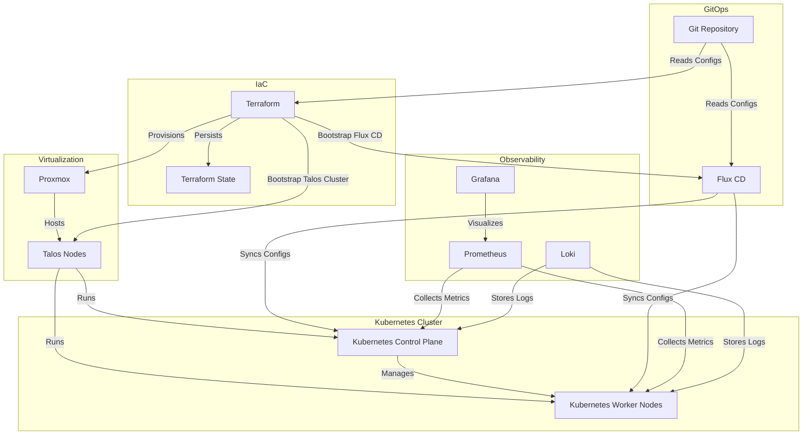

# Platform Engineering Homelab

Exploring declarative infrastructure, automation, Kubernetes, and GitOps for the AI boom era.

## Overview

This project aims to build a **platform service environment** that mimics production-grade practices used by leading technology organizations.

The platform is responsible for:

1. Owning the end-to-end developer experience from code commit to production deployment.
2. Kubernetes cluster lifecycle management, including provisioning, upgrades, security baselines, and governance guardrails.
3. Multi-tenant safety through namespace isolation, policies, and resource boundaries.
4. Standardized delivery pipelines from CI to artifact creation to GitOps-based deployment.
5. Observability, operational visibility, and platform-level SLOs.
6. Platform APIs and UX, including portals, CLI abstractions, and documentation.

## Goals

1. A single, opinionated deployment workflow:
   `git push` or PR merge ⇒ the platform handles build, deploy, rollout, and observability.
2. Clear golden paths:
   * Service template
   * Add dependencies
   * Expose endpoints
   * Access logs, metrics, and traces
3. Minimal or zero Kubernetes objects authored directly by product teams.
4. Developers interact with **platform abstractions**, not raw Kubernetes primitives.

## Non-Goals

1. Building a commercial or customer-facing platform.
2. Supporting multiple cloud providers or hybrid cloud environments.
3. Implementing complex multi-cluster or multi-region architectures.

## Roadmap

### Phase 1: Foundations
- [x] **Proxmox Dev Environment**: Virtualized Talos Kubernetes nodes on Arch Linux, using a Ryzen 9 Mini PC (32GB RAM, 2TB SSD) for flexibility and isolation.
- [ ] **Bare-Metal Prod Environment**: Talos Kubernetes on HP EliteDesk (Core i7-7700, 32GB RAM, 512GB SSD) and N95 Mini PC (16GB RAM, 512GB SSD) for production-grade workloads.
- [x] **Hardware Allocation**:
  - HP EliteDesk as Control Plane + Worker (due to homelab constraints).
  - N95 Mini PC as Dedicated Worker for redundancy and scalability.

### Phase 2: CI/CD and GitOps
- [ ] **CI Pipeline in Dev**: Set up GitHub Actions/GitLab CI to automate builds, tests, and staging.
- [ ] **GitOps with Flux CD**:
  - Bind Flux CD in prod to the `main` branch for automated, auditable deployments.
  - Use approval gates: main -|automatically|-> dev -|approval|-> prod.
- [ ] **Promotion Workflow**: Document the process for promoting changes from dev to prod via GitOps.

### Phase 3: Observability and Guardrails
- [ ] **Unified Observability**:
  - Deploy Prometheus, Loki, and Grafana to monitor both dev and prod environments.
  - Create dashboards for resource usage, application health, and GitOps sync status.
- [ ] **Platform Guardrails**:
  - Define namespace quotas, Pod Security Standards, and network policies in both environments.
  - Use policy-as-code enforcement.
- [ ] **Alerting**: Set up alerts for critical events.

### Phase 4: Operational Readiness
- [ ] **Backup and Disaster Recovery**:
  - Implement backup strategies for Kubernetes resources and persistent volumes.
  - Test restore procedures in both environments.
- [ ] **Day 2 Operations**:
  - Document upgrade procedures for Talos, Kubernetes, and Flux CD.
  - Simulate failure scenarios and recovery steps.
- [ ] **Immutability and Security**:
  - Enforce Talos OS updates and Kubernetes upgrades via GitOps.
  - Audit logs and access controls for both environments.

### Phase 5: Platform Abstractions (Future)
- [ ] **Developer Self-Service**:
  - Create service templates so "product teams" can deploy apps without writing Kubernetes YAML.
    - Example: Developers deploy Nextcloud by submitting a PR to a service template repo—no need to author K8s YAML.
  - Platform provides CLI commands like `platform deploy` to handle builds, rollouts, and observability setup.
- [ ] **Golden Paths**: Standardize how apps are deployed, exposed, and monitored.

## 🏗️ Architecture

## 🌐 Environments

| Environment | Purpose                        | Hardware/Platform                   | Specifications                                                                                                              | Role in Platform Service                                                                                   |
| ----------- | ------------------------------ | ----------------------------------- | --------------------------------------------------------------------------------------------------------------------------- | ---------------------------------------------------------------------------------------------------------- |
| **Dev**     | Testing, CI/CD, staging        | Proxmox (Virtualized on Arch Linux) | -**Mini PC (Ryzen 9)**: AMD Ryzen 9, 32GB RAM, 2TB M.2 SSD - Host: Arch Linux - VMs: Talos Kubernetes nodes           | - Safe space for experimentation and validation. - Simulates a "staging" environment for product teams. |
| **Prod**    | Hosting "production" workloads | Bare-Metal Talos Kubernetes         | - **HP EliteDesk 800 G3**: Core i7-7700, 32GB RAM, 512GB M.2 SSD - **Mini PC (N95)**: Intel N95, 16GB RAM, 512GB M.2 SSD | - Mimics a real production environment. - Demonstrates IaC, GitOps, and observability in action.        |

### Why This Setup?
- **Dev (Proxmox VE + Talos):**
  - *Flexibility*: Quickly spin up/destroy VMs to test Terraform changes or GitOps configurations.
  - *Isolation*: Prevents accidental disruption of production workloads.
  - *Cost-Effective*: Uses my existing Arch Linux desktop resources.

- **Prod (Bare-Metal Talos):**
  - *Performance*: No virtualization overhead for production workloads.
  - *Realism*: Closer to enterprise environments, where bare-metal or cloud VMs are standard.
  - *Immutability*: Talos OS enforces security and consistency, aligning with platform engineering best practices.

- **Hardware Allocation:**
  - HP EliteDesk as **Control Plane + Worker**: Balances cost and performance for a homelab. Note: Control plane and worker nodes are on the same machine due to hardware constraints.
  - N95 Mini PC as **Dedicated Worker**: Adds redundancy and scalability for future workloads.

## 🎯 Lessons Learned

### Terraform

- Even though modules can depend on each other, some providers like Kubernetes need the cluster to be fully operational before its usage. For instance, the Kubernetes provider cannot be evaluated until the kubeconfig is available.
  - To mitigate this, I executed terraform apply in two stages: first to provision the cluster, then to continue with the modules that depend on it.
  - Ex.: `terraform apply -target=module.cluster` followed by `terraform apply`.
- As I want to persist the terraform state, I was thinking about using MinIO as a backend. However, I realized that the MinIO maintainers decided to stop providing support for docker images.
  - As an alternative, I opted to use [Garage](https://garagehq.deuxfleurs.fr/), as an S3-compatible object storage solution that can be easily deployed within the Kubernetes via the Helm chart.
  
### Talos 

- Talos OS is immutabe, that means we should not try to ssh into the nodes to make changes. Instead, we should use Talosctl.
- As I decided to use TopoLVM for storage management, I had to create a Volume Group on each Talos node using local disks.
  - To achieve this, I created a Daemonset that runs a container with required tools installed to create a Volume Group. Since it is a Daemonset, it runs on all nodes, ensuring that the Volume Group is created on each one.

### Kubernetes

- Manage local persistent volume can be challenging, especially when dealing with multiple nodes, ensuring data persistence to prevent data loss, and handling volume lifecycle.
  - Using TopoLVM simplifies this by providing dynamic volume provisioning and management capabilities.

## 🔮 Future Plans
1. GPU Passthrough:
   - *Goal:* Enable AI/ML workloads on Kubernetes.
   - *Why:* Prepare the platform for the AI boom and demonstrate multi-workload support.
2. MLOps Tools:
   - *Goal:* Evaluate Kubeflow and Argo Workflows for standardized ML pipelines.
   - *Why:* Align with industry trends and expand platform capabilities.
3. Edge Computing:
   - *Goal:* Simulate IoT devices using K3s on Raspberry Pi.
   - *Why:* Showcase scalability and edge-use-case support.
  

## 📫 Connect
- [LinkedIn](https://www.linkedin.com/in/adriano-oliveira/)
- [GitHub](https://github.com/odrianoaliveira/)
