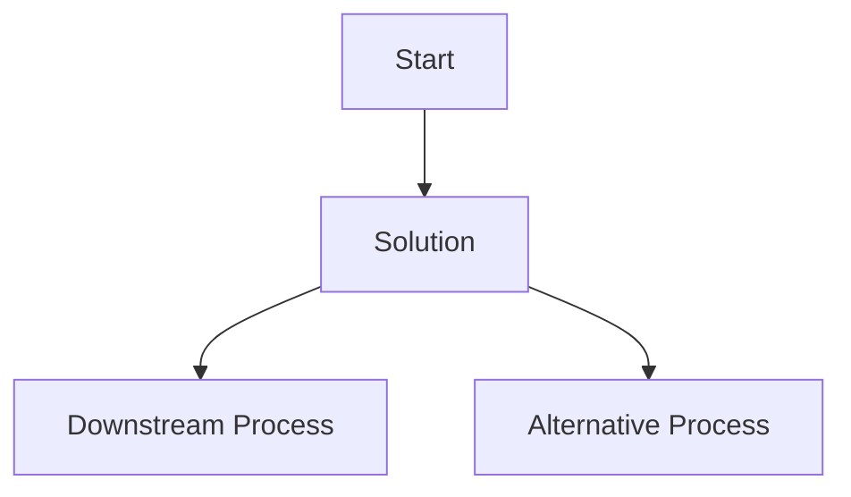

# ADR Title

**Date:** YYYY-MM-DD

## Status
Proposed | Accepted | Deprecated | Superseded by [ADR-000X](000X-adr-title.md)

## Context
Describe the issue or situation that led to the decision. Include any relevant background information, constraints, and requirements.

## Decision
Describe the decision that was made. Include details about the chosen solution, alternatives considered, and the rationale behind the decision.

### Architecture
Include diagrams or descriptions of the architecture that supports the decision. Use tools like Mermaid for visual representation if necessary.

## Consequences
Describe the outcomes of the decision. Include both positive and negative consequences, as well as any trade-offs that were made.
Discuss how this decision impacts future work and any potential risks or challenges.

### Positive Consequences
- List the benefits and advantages of the decision.
- Explain how it addresses the context and requirements.
- Highlight any improvements in processes, performance, or user experience.

### Negative Consequences
- List any drawbacks or disadvantages of the decision.
- Explain any challenges or issues that may arise.
- Highlight any potential risks or trade-offs involved.

## References

- List any relevant documents, articles, or resources that were referenced in making the decision.

