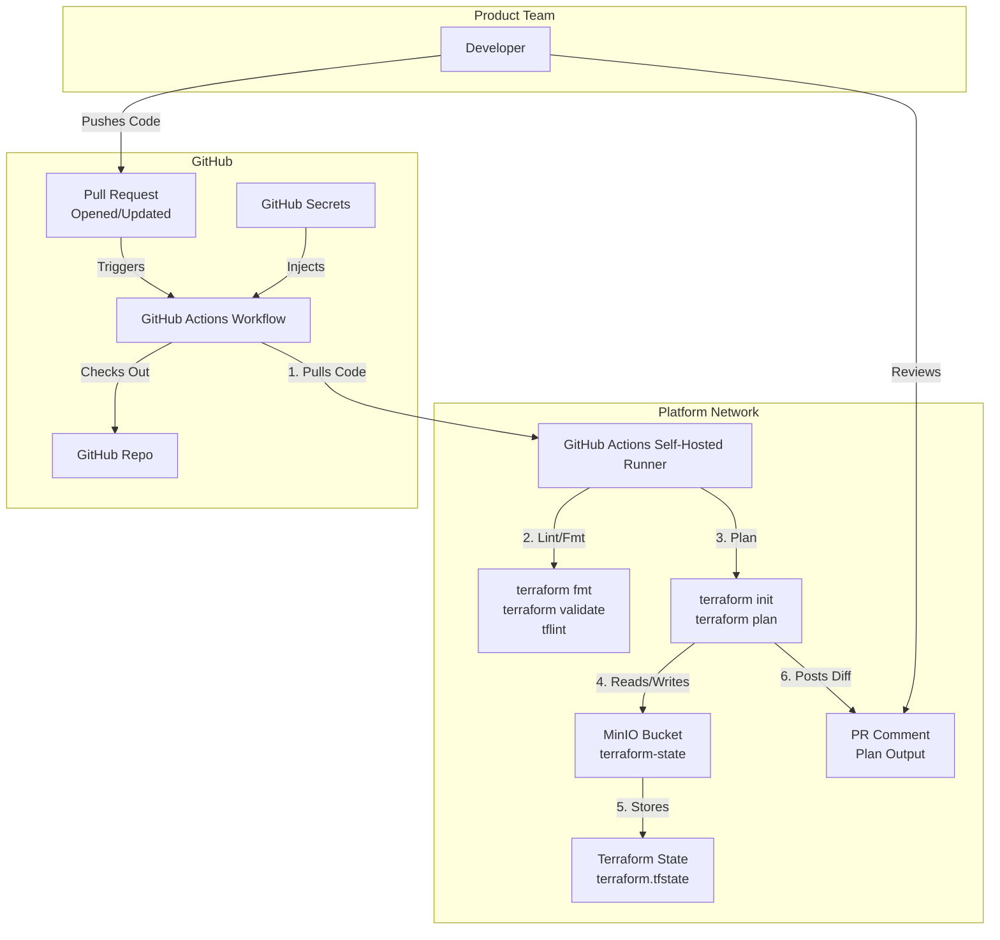

# Terraform CI/CD Pipeline for On-Premise Platform Services

**Date:** 2025-12-20

## Status
Accepted

## Context
To automate the infrastructure using IaC practices on my on-premise platform services, I aim to design a CI/CD pipeline for managing Terraform configurations.
The pipeline should:

- Enforce code quality, security, and style consistency.
- Provide visibility into proposed changes via Terraform plan output.
- Store Terraform state securely on-premise.
- Integrate seamlessly with GitHub for version control and collaboration.

The on-premise platform services environment is fully managed via Terraform and hosted on-premise, with GitHub as the source of truth for all infrastructure changes.

## Decision
I will design and implement a GitHub Actions-based CI/CD pipeline with the following components:
- GitHub Actions Workflow: Triggers on PRs and pushes to `main`, running linting, validation, and planning.
- Self-Hosted GitHub Runner: Executes workflows within the on-premise network for security and access to internal resources.
- MinIO: Stores Terraform state on-premise, with no public exposure.
- Terraform Backend: Configured to use MinIO for state storage.
- PR Annotation: Posts `terraform plan` output as a PR comment for review.

### Architecture

## Consequences

### Positive
- Automated Quality Checks: Enforces code quality and style with `terraform fmt`, `terraform validate`, and `tflint`.
- Secure State Management: Terraform state is stored on-premise in MinIO, reducing exposure to public networks.
- Transparency: Plan output is visible as PR comments, enabling collaborative review.
- Scalability: The pipeline can be extended to include additional checks (e.g., security scanning, cost estimation).
- Homelab Integration: Self-hosted runner ensures compatibility with internal networking and resources.

### Negative
- Complexity: Setting up a self-hosted runner and MinIO requires initial effort and maintenance.
- Resource Overhead: Running CI/CD workflows on-premise consumes homelab resources.
- Learning Curve: Configuring GitHub Actions, MinIO, and Terraform backends may require time for unfamiliar users.

## References
- [GitHub Actions Documentation](https://docs.github.com/en/actions)
- [Terraform Backends: S3](https://developer.hashicorp.com/terraform/language/settings/backends/s3)
- [MinIO Documentation](https://min.io/docs/minio/linux/index.html)
- [Terraform: GitHub Actions](https://developer.hashicorp.com/terraform/tutorials/automation/github-actions)
- [tflint: A Terraform Linter](https://github.com/terraform-linters/tflint)
