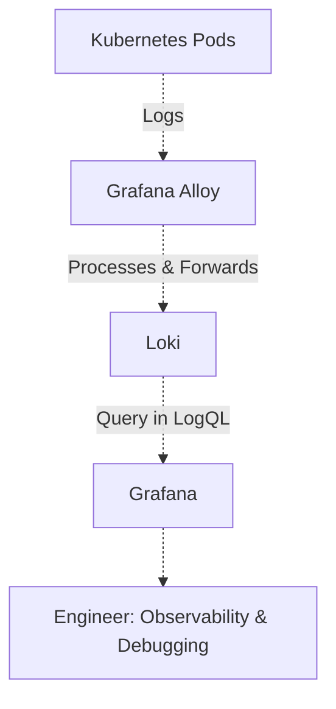

# ADR 001: Adopt Loki for Kubernetes Log Aggregation

**Date:** 2026-02-03

## Status
Accepted

## Context

As part of my homelab, I need a log aggregation solution for my Kubernetes cluster.
The solution must:
- Aggregate logs from all Kubernetes pods and nodes.
- Support filtering by Kubernetes metadata (e.g., namespace, pod, container).
- Operate within the constraints of my homelab environment (limited resources, focused on self-hosting and security).

Given these requirements, I evaluated both **Loki** and **Elasticsearch**:
- **Elasticsearch** is powerful and feature-rich but resource-intensive, requiring significant CPU, memory, and storage for full-text indexing and cluster management. This makes it less suitable for my constrained homelab environment.
- **Loki** is purpose-built for cloud-native, Kubernetes-centric logging. It indexes only log metadata and stores log bodies in compressed chunks, making it lightweight and cost-efficient.

## Decision

I will adopt **Loki** as the log aggregation solution for my Kubernetes cluster. Loki will be deployed in a simple, and scalable mode. The decision is based on:
- Resource efficiency: Loki's minimal indexing and storage footprint are ideal for my homelab's limited resources.
- Kubernetes-native design: Loki is optimized for Kubernetes environments, making it easy to deploy and manage alongside my existing k8s cluster.
- Metadata filtering: Loki's label-based approach allows me to filter logs by Kubernetes metadata, which is sufficient for my debugging and observability needs.
- Integration with Grafana: Loki natively integrates with Grafana, which I decided as my monitoring solution.
- Simplicity: Loki's architecture is simpler to operate and scale compared to Elasticsearch, reducing maintenance overhead.

## Architecture

Loki will be deployed as follows:
1. Loki Server: Deployed as a StatefulSet in the Kubernetes cluster, configured to use local storage (Longhorn) for log retention.
2. Grafana Alloy: Collects logs from Kubernetes pods and forwards them to Loki.
3. Grafana: Used for querying and visualizing logs.

- Grafana Alloy collects logs and metrics from Kubernetes, grafana alloy was designed to replace promtail and grafana agent in a single component.
- Loki stores logs in compressed chunks and indexes only metadata, enabling fast filtering.
- Grafana provides dashboards and alerts based on log queries.

## Consequences

### Positive Consequences
- Low resource usage: Loki's design minimizes computational resource consumption, making it suitable for my homelab.
- Efficient filtering: Logs can be quickly filtered by Kubernetes metadata.
- Seamless integration: Loki works out-of-the-box with Grafana.
- Scalability: Loki's architecture allows for easy horizontal scaling.

### Negative Consequences
- Limited full-text search: Loki does not support full-text search across log contents.
- Learning curve: LogQL (Loki's query language) is less familiar to me than Elasticsearch's Query DSL.
  
## References

- [Loki Documentation](https://grafana.com/docs/loki/latest/)
- [Loki vs. Elasticsearch: Choosing the Right Logging System](https://www.kubeblogs.com/loki-vs-elasticsearch/)
- [Grafana Loki GitHub Repository](https://github.com/grafana/loki)
- [Loki Helm Chart](https://github.com/grafana/helm-charts/tree/main/charts/loki)
- [Grafana Alloy Documentation](https://grafana.com/docs/alloy/latest/)
