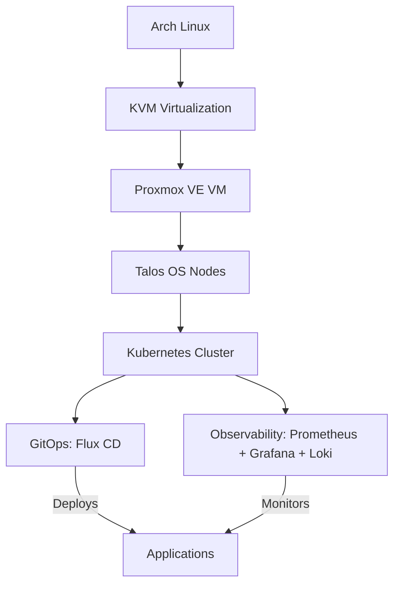

# Homelab Kubernetes Automation: Arch Linux KVM → Proxmox VE → GitOps

A fully automated, production-grade Kubernetes homelab built on Arch Linux KVM → Proxmox VE (virtualized) → Talos OS → Kubernetes → GitOps, with observability for logging, tracing and metrics.
This project demonstrates end-to-end platform engineering principles for deploying and managing Kubernetes clusters with minimal manual intervention, leveraging Infrastructure as Code (IaC) and GitOps practices.

## 🎯 Goals
1. Fully Automated Kubernetes Cluster Provisioning:
   - Deploy a production-ready Kubernetes cluster from Arch Linux KVM → Proxmox VE → Talos OS → Kubernetes, using IaC (Terraform).
2. Immutable Infrastructure:
   - Use Talos OS for a secure, immutable Kubernetes environment.
3. GitOps Workflow:
   - Implement Flux CD for declarative, version-controlled deployments.
4. Observability Stack:
   - Deploy Prometheus, Grafana, and Loki for metrics, logging, and monitoring.
5. Reproducibility:
   - Ensure the entire setup is deterministic with minimal manual steps to mitigate configuration drift.

## 🏆 Outcomes
- Reduced manual setup time by 90% (from hours to minutes).
- Consistent, deterministic deployments with no configuration drift.
- Self-healing infrastructure via GitOps and Talos OS.
- Full observability for cluster health, performance, and logs.
- Scalable foundation for future projects (e.g., AI/ML workloads, MLOps).

## 🏗️ Architecture

### 📦 Components
| Layer                       | Technology                  | Purpose                                                                                                                                  |
| --------------------------- | --------------------------- | ---------------------------------------------------------------------------------------------------------------------------------------- |
| Host OS                     | Arch Linux                  | Host OS for KVM virtualization. Since the host is my personal desktop, I decided to run Proxmox VE virtualized for educational purposes. |
| Virtualization              | KVM/QEMU                    | Manages the Proxmox VE VM. Obs: In a production environment, this would be bare-metal.                                                   |
| Virtualization (Proxmox VE) | Proxmox VE (virtualized)    | Manages Talos OS VMs and virtualized infrastructure.                                                                                     |
| Node OS                     | Talos OS                    | Immutable, secure OS for Kubernetes nodes.                                                                                               |
| Orchestration               | Kubernetes                  | Container orchestration for workloads.                                                                                                   |
| Netwrorking                 | TDB                         | CNI for pods networking.                                                                                                                 |
| Storage                     | TDB                         | Distributed storage solution for persistent volumes.                                                                                     |
| IaC                         | Terraform                   | Provision Proxmox VE VMs and Talos nodes.                                                                                                |
| GitOps                      | Flux CD                     | Automated, declarative deployments from Git.                                                                                             |
| Observability               | Prometheus + Grafana + Loki | Metrics, logging, and monitoring for cluster health.                                                                                     |

## 📚 Lessons Learned
1. Proxmox VE Virtualized on KVM:
TDB

2. Talos OS is a Game-Changer for Kubernetes:
TDB

3. Terraform + Proxmox VE = Powerful Combo:
TDB

4. GitOps Simplifies Application Management:
TDB

5. Observability is Non-Negotiable**:
TDB

6. Networking is Critical:
TDB

7. Documentation Saves Hours:
   - Undocumented changes led to reproducibility issues.
   - Solution: Added a `docs/` folder with runbooks, architecture diagrams, and troubleshooting guides.

## 💻 Code and Configuration

### GitHub Repository

- Link: [odrianoaliveira/homelab/k8s-automation](https://github.com/odrianoaliveira/homelab/tree/main/k8s-automation)
- Key Directories:

  | Directory        | Purpose                                                        |
  | ---------------- | -------------------------------------------------------------- |
  | `terraform/`     | Terraform scripts to provision Proxmox VE VMs and Talos nodes. |
  | `flux/`          | GitOps manifests for Flux CD.                                  |
  | `observability/` | Helm charts and manifests for Prometheus, Grafana, and Loki.   |
  | `docs/`          | Architecture diagrams, runbooks, and troubleshooting guides.   |

## 🚀 Next Steps

1. Add GPU Support:
   - Experiment with PCI passthrough or NVIDIA GPU Operator for AI/ML workloads.
2. Deploy AI/ML Workloads:
   - Set up Kubeflow or KServe for model serving.
3. Chaos Engineering:
   - Test cluster resilience with Chaos Mesh.
4. Multi-Cluster Management:
   - Explore Kubernetes Federation or Cluster API for managing multiple clusters.
5. Cost Optimization:
   - Experiment with auto-scaling and resource bin-packing.

## 📫 Feedback and Collaboration
- **Issues or Questions**: Open an issue on [GitHub](https://github.com/odrianoaliveira/homelab).
- **Connect**: [LinkedIn](https://www.linkedin.com/in/adriano-oliveira)
